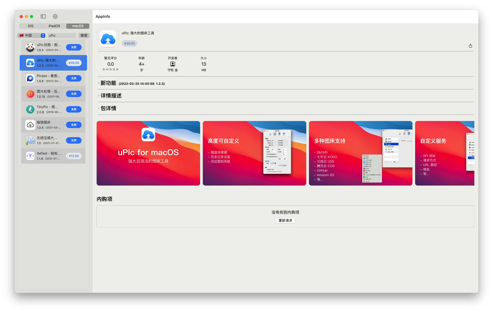

# AppInfo-Publish
# iOS&iPadOS

### Download

- [Releases](https://github.com/uclort/AppInfo-Publish/releases)

### Install

* [AltStore](https://altstore.io/)

### Perview

<div align="center">
  <a href="https://github.com/uclort/AppInfo-Publish/tree/main/Preview">
  
</div>


<div align="center">
  <a href="https://github.com/uclort/AppInfo-Publish/tree/main/Preview">
  
</div>


# macOS

### Download

- [Releases](https://github.com/uclort/AppInfo-Publish/releases)

### Install

- Homebrew

  ```
  brew install bigwig-club/brew/appinfo --cask
  ```

### Perview

<div align="center">
  <a href="https://github.com/uclort/AppInfo-Publish/tree/main/Preview">
  
</div>

<div align="center“">
  <a href="https://github.com/uclort/AppInfo-Publish/tree/main/Preview">
  
</div>